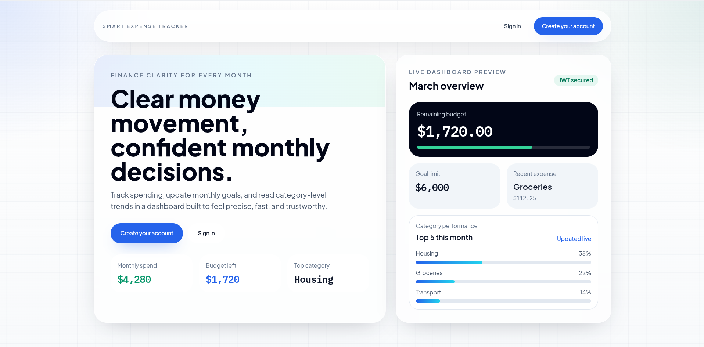
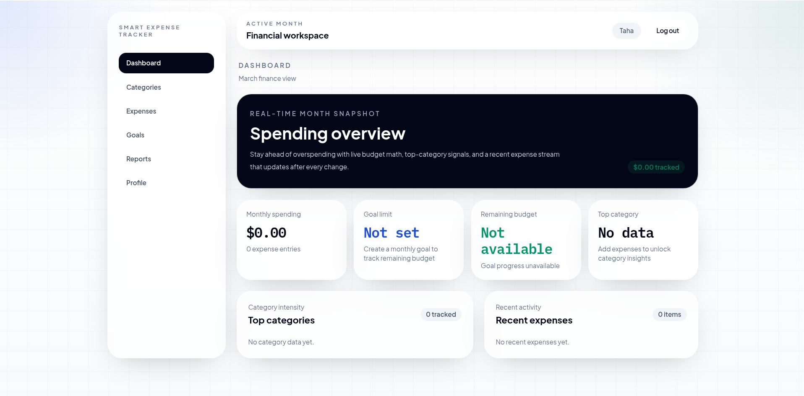
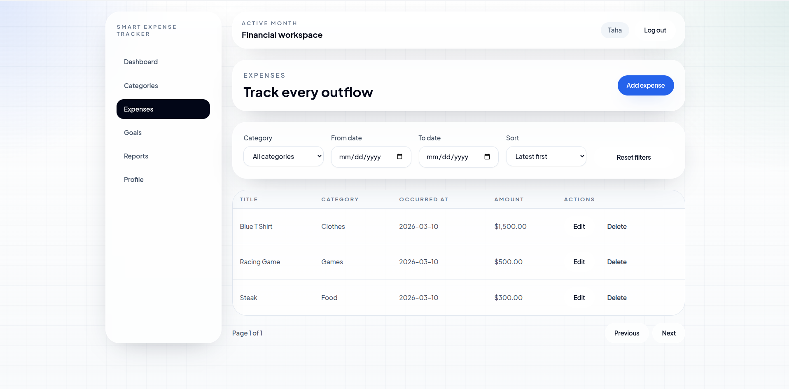

# Smart Expense Tracker

Smart Expense Tracker is a production-minded full-stack finance application built with React, FastAPI, PostgreSQL, and Docker. It combines a polished user experience with secure authentication, versioned APIs, database migrations, automated testing, and GitHub Actions CI so the project reads like a real delivery artifact rather than a basic CRUD demo.

## Why This Project Stands Out

- Modern React 19 frontend with a clean dashboard, goal tracking, expense workflows, and reporting views
- FastAPI backend with versioned REST endpoints under `/api/v1`
- JWT-based authentication with password hashing and protected routes
- PostgreSQL persistence with Alembic migrations for controlled schema evolution
- Request ID propagation, request logging, and a health endpoint for operational visibility
- Dockerized frontend, backend, and database services for consistent local and deployment-ready environments
- Automated backend and frontend test coverage in the repo
- GitHub Actions CI that runs endpoint tests on pushes and pull requests to `main`

## Screenshots

### Landing Page

Product-facing entry point that frames the app as a serious finance dashboard instead of a generic starter app.



### Dashboard

High-signal monthly overview with budget progress, recent activity, and decision-ready financial context.



### Expenses

Core transaction workflow for managing expenses with a UI designed for real usage, not just feature demonstration.



## Production-Minded Foundations

This repository is structured like a shippable application:

- Security: JWT token issuance, password hashing, authenticated API access
- API discipline: explicit route grouping for auth, expenses, categories, goals, and reports
- Data lifecycle: Alembic-managed schema changes instead of ad hoc database edits
- Operational basics: `/health` endpoint, request IDs, and request logging middleware
- Delivery workflow: Dockerized services and CI automation through GitHub Actions
- Test coverage: backend tests for auth, categories, expenses, goals, reports, migrations, and health checks, plus frontend tests for routing, auth flow, and key pages

## Architecture

### Frontend

- React 19
- TypeScript
- Vite
- React Router
- TanStack Query
- Recharts
- Tailwind CSS

### Backend

- FastAPI
- SQLAlchemy
- PostgreSQL
- Alembic
- PyJWT
- `pwdlib` password hashing

### Infrastructure

- Docker multi-container setup via `docker compose`
- Nginx-based frontend container
- Python 3.12 backend container
- PostgreSQL 17 database service
- GitHub Actions workflow for endpoint validation

## Project Structure

```text
smart-expense-tracker/
├── backend/      # FastAPI app, models, services, repositories, tests, and migrations
├── frontend/     # React app, routes, pages, UI components, and feature modules
├── screenshots/  # README assets
├── docs/         # Planning and supporting documentation
└── docker-compose.yml
```

## Feature Set

- User registration, login, and profile retrieval
- Expense CRUD with filters, sorting, and pagination
- Category management for cleaner expense organization
- Monthly goal creation, update, and progress tracking
- Monthly reporting with charts and summary metrics
- Dashboard summaries that surface budget and spending signals quickly

## Quick Start With Docker

1. Create a root `.env` file.
2. Add the required environment variables:

```env
POSTGRES_USER=postgres
POSTGRES_PASSWORD=postgres
POSTGRES_DB=smart_expenses
POSTGRES_PORT=5432
JWT_SECRET=change-this-secret
VITE_API_BASE_URL=http://localhost:8080/api/v1
```

3. Build and run the stack:

```bash
docker compose up --build
```

4. Access the application:

- Frontend: `http://localhost:5173`
- Backend API: `http://localhost:8080`
- FastAPI docs: `http://localhost:8080/docs`

## Local Development

### Backend

```bash
cd backend
python -m venv .venv
source .venv/bin/activate
pip install -r requirements.txt
alembic upgrade head
uvicorn app.main:app --reload --host 0.0.0.0 --port 8080
```

If PostgreSQL is running outside Docker, set `POSTGRES_HOST=localhost` before starting the API.

### Frontend

```bash
cd frontend
npm install
npm run dev
```

The frontend defaults to `http://localhost:8080/api/v1` when `VITE_API_BASE_URL` is not set.

## Testing and CI

### Local test commands

Backend:

```bash
cd backend
pytest
```

Frontend:

```bash
cd frontend
npm test
```

### GitHub Actions CI

The repository includes a GitHub Actions workflow at `.github/workflows/endpoint_test.yaml` that runs automated endpoint tests on:

- pushes to `main`
- pull requests targeting `main`

That means the project already has a real CI checkpoint in place, not just local-only test commands.

## API Surface

All backend routes are exposed under `/api/v1`.

### Authentication

- `POST /users/register`
- `POST /users/login`
- `GET /users/me`

### Expenses

- `GET /expenses`
- `POST /expenses`
- `GET /expenses/{expense_id}`
- `PATCH /expenses/{expense_id}`
- `DELETE /expenses/{expense_id}`

### Categories

- `GET /categories`
- `POST /categories`
- `GET /categories/{category_id}`
- `PATCH /categories/{category_id}`
- `DELETE /categories/{category_id}`

### Goals

- `POST /goals`
- `PUT /goals/{goal_id}`
- `GET /goals`
- `GET /goals/progress`
- `GET /goals/{goal_id}`

### Reports

- `GET /reports/monthly`

## Health Check

The backend exposes a lightweight health endpoint:

```text
GET /health
```

Expected response:

```json
{"health":"ok"}
```

## Summary

This project is positioned as a serious full-stack engineering artifact: secure auth, database migrations, containerized services, automated tests, CI integration, operational hooks, and a user-facing interface that goes beyond boilerplate. It is a strong portfolio-grade example of how to build and package a modern expense tracking platform with delivery discipline in mind.
